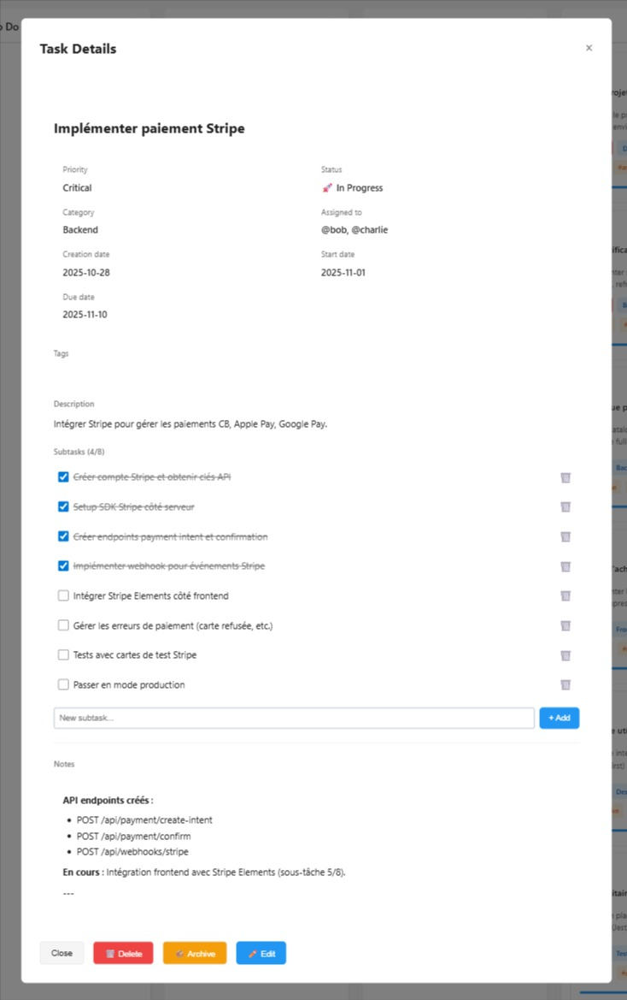
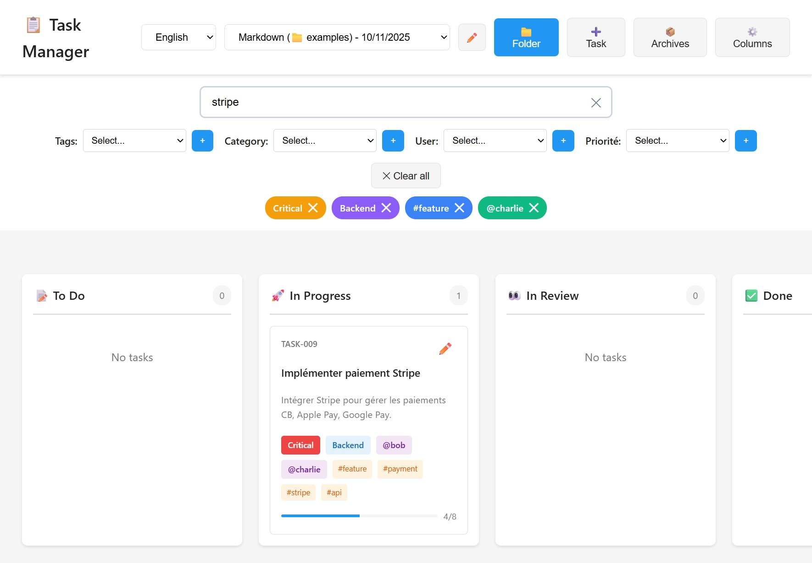
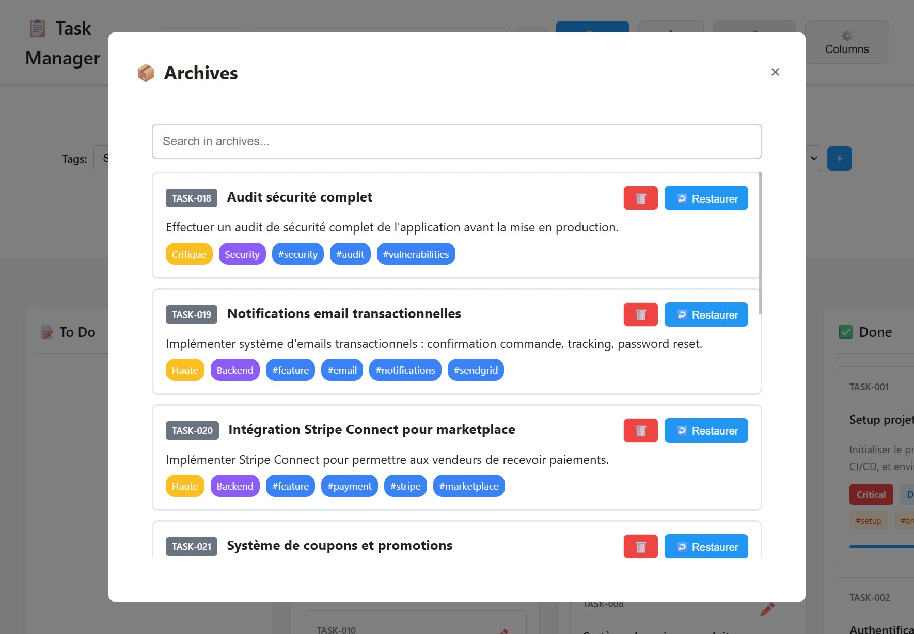
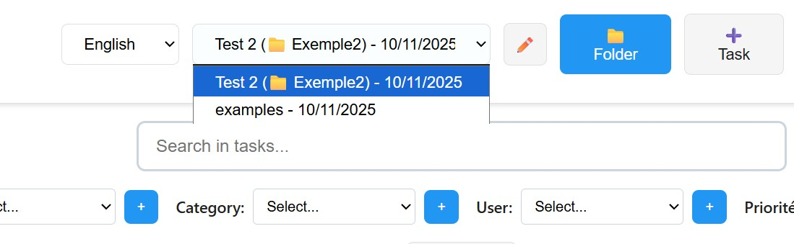

# Void.md

<p align="center">
  
</p>

> **Visual Kanban. Plaintext Soul. No Cloud.**

> **[🇫🇷 Version française / French version](./readmeFR.md)**

**Local-first Kanban over Markdown** — your files are the database. No account, no cloud sync: open `void.html`, pick a folder, own your data.

### Pseudo-IT sovereignty

Void.md is **plaintext infrastructure**: `kanban.md` and `archive.md` live where you put them (disk, repo, backup). The browser only reads/writes files you authorize via the File System Access API. There is **no hosted backend** — telemetry optional, storage **local**. Suitable for air-gapped workflows and Git-friendly task history.

---

## 📝 Latest Updates (April 2026)

### Documentation and Kanban behavior

- **[`docs/README.md`](docs/README.md)** — index to all major docs (AI workflow, architecture, templates, core package)
- **[`docs/AI_WORKFLOW.md`](docs/AI_WORKFLOW.md)** — `**Columns**:` must use `Emoji Name (id)` per column; without IDs, tasks may not appear on the board
- **[`core-package/AI_GUIDE.md`](core-package/AI_GUIDE.md)** — portable summary for coding agents (same column-ID rules)
- **Kanban:** checking subtasks, editing subtasks, and dragging cards between columns avoid a full board rebuild when possible (smoother UI; see `CHANGELOG.md` v1.3.2)

### Rich Text Editor (Tiptap)

- Toggle between plain Markdown and rich text for task Notes
- Formatting toolbar: Bold, Italic, Code, Bullet list, Numbered list
- Lazy-loads from CDN with automatic fallback to plain text
- Stored as Tiptap JSON in IndexedDB for rich mode, Markdown for plain mode

### Modal & Header UX

**📐 Modal sizing and behavior**

- New Task, Task detail, and Settings modals use 90vh height and consistent width; only the modal body scrolls (no page scroll behind)
- Close any modal by clicking outside (backdrop) or pressing Escape
- Body scroll is locked while a modal is open

**🧭 Header and filter bar**

- Header: Project label + dropdown, grouped actions (project vs Settings/Folder/New Task), responsive wrap
- Filter bar width and padding aligned with header (1400px max)
- ARIA labels on icon-only buttons for accessibility

### Earlier (January 2026)

**🎨 Dark mode, header cleanup, welcome project selector**

- 7-level dark mode color hierarchy; Language, Theme, Archives, Columns in Settings
- Welcome screen project selector; stability fixes (task creation, modal close, null checks)

### Related Documentation
- **[`docs/README.md`](docs/README.md)** — **documentation index** (start here for architecture, templates, and AI files)
- `CHANGELOG.md` — full version history
- `docs/UI_UX_RECOMMENDATIONS.md` — UI/UX spec (mostly implemented)
- `docs/architecture/FIXES-SUMMARY.md` — bug fixes (historical sessions)
- `docs/AI_WORKFLOW.md` — markdown task format and AI editing rules (including `kanban.md` column IDs)
- `AGENTS.md` — build/test and code style for AI assistants
- **[`docs/github-pages.md`](docs/github-pages.md)** — optional: host `void.html` on **GitHub Pages** (three branch builds under one site)

---

A complete task management system that transforms your Markdown files into an interactive Kanban board, without database or server. Perfect for developers, distributed teams and integration with AI assistants.


*Overview of the Void.md interface with Kanban board, filters, and task management*

---

## 🎯 What is it?

Void.md is a **standalone web application** contained in a single HTML file (`void.html`). It uses the browser's File System Access API to read and write directly to your local Markdown files.

### How it works

```
┌─────────────────────┐
│  void.html  │  ← Single HTML file
└──────────┬──────────┘
           │
           ▼
    ┌──────────────┐
    │   Browser    │  ← Chrome, Edge, Opera
    └──────┬───────┘
           │
           ▼
    ┌──────────────┐
    │  Your files  │  ← kanban.md + archive.md
    │   Markdown   │     (on your disk)
    └──────────────┘
```

**Advantages:**

- ✅ **Single file**: Easy to copy, share and maintain
- ✅ **100% local**: Your data stays on your machine
- ✅ **Git compatible**: Versionable, syncable, diffable
- ✅ **Plain text readable**: Editable with any editor
- ✅ **No server**: Works entirely in the browser
- ✅ **Multi-project**: Manage multiple projects with history

---

## ⚡ Quick Start

### Prerequisites

- **Compatible browser**: Chrome 86+, Edge 86+ or Opera 72+
- File System Access API is not available on Firefox or Safari

### Installation in 3 steps

1. **Download** `void.html` from this repository
2. **Open it** in your browser (double-click)
3. **Select** a folder to store your tasks

That's all! 🎉

### First use

On first launch:

1. The application requests access to a folder
2. If the folder is empty, it automatically creates:
   - `kanban.md` - Your active tasks
   - `archive.md` - Your archived tasks
3. You can give a name to the project
4. The project is remembered for next sessions

---

## 📦 Project Installation

### Option 1: Root installation (recommended)

Simply copy 2 files to your project root:

```bash
my-project/
├── kanban.md          # ← Create this file (see template below)
├── archive.md         # ← Create this file (see template below)
├── src/
├── package.json
└── README.md
```

**Minimal kanban.md template:**

```markdown
# Kanban Board

## ⚙️ Configuration

**Columns**: 📝 To Do | 🚀 In Progress | ✅ Done
**Categories**: Frontend, Backend, Design
**Users**: @alice, @bob
**Tags**: #bug, #feature, #docs

## 📝 To Do

## 🚀 In Progress

## ✅ Done
```

**Minimal archive.md template:**

```markdown
# Task Archive

> Archived tasks from the project

## ✅ Archives
```

Then:

1. Open `void.html` in your browser
2. Select the `my-project/` folder
3. Start creating tasks!

### Option 2: Subdirectory installation

If you prefer to isolate task files:

```bash
my-project/
├── .tasks/            # ← or docs/tasks/, .kanban/, etc.
│   ├── kanban.md
│   └── archive.md
├── src/
└── package.json
```

Then, select the `.tasks/` folder when opening the application.

### Option 3: Add to .gitignore (optional)

If you don't want to version your tasks:

```bash
# .gitignore
kanban.md
archive.md
# or
.tasks/
```

**Note:** It is generally recommended to **version** task files to keep history and sync with the team.

---

## 🗂️ HTML File Management

You have 2 options to manage `void.html`:

### Option A: One copy per project

```bash
project-1/
├── void.html  # ← Local copy
├── kanban.md
└── archive.md

project-2/
├── void.html  # ← Local copy
├── kanban.md
└── archive.md
```

**Advantages:**

- ✅ Complete autonomy for each project
- ✅ Works even if central file is modified
- ✅ Can be versioned with the project

**Disadvantages:**

- ❌ HTML file duplication
- ❌ Manual update in each project

### Option B: Single centralized file (recommended)

```bash
~/tools/
└── void.html  # ← Single copy

~/projects/
├── project-1/
│   ├── kanban.md
│   └── archive.md
├── project-2/
│   ├── kanban.md
│   └── archive.md
└── project-3/
    ├── kanban.md
    └── archive.md
```

**Advantages:**

- ✅ Single file to maintain
- ✅ Automatic updates for all projects
- ✅ Disk space savings

**Disadvantages:**

- ❌ Dependency on external file

**How to use it:**

1. Keep `void.html` in an accessible folder (e.g., `~/tools/`)
2. Create a shortcut/bookmark in your browser
3. Open it and select the desired project folder
4. The application remembers the last 10 projects

**Tip:** Create an alias to open it quickly:

```bash
# ~/.bashrc or ~/.zshrc
alias tasks='open ~/tools/void.html'  # macOS
alias tasks='xdg-open ~/tools/void.html'  # Linux
alias tasks='start ~/tools/void.html'  # Windows
```

---

## 🤖 AI Assistants Integration

This system is designed to work with AI assistants to achieve **complete traceability** of work done.

### Principle

AI assistants (Claude, ChatGPT, Copilot, Gemini, etc.) can:

1. ✅ Create tasks with strict format in `kanban.md`
2. ✅ Break down complex tasks into subtasks
3. ✅ Update progress in real time
4. ✅ Document complete result in `**Notes**:`
5. ✅ Reference tasks in Git commits (`TASK-XXX`)
6. ✅ Archive on demand only (not automatically)

### When AI edits `kanban.md` (columns)

Void.md reads **`**Columns**:`** with an **`Emoji Name (id)`** segment per column (documented below under **Configuration and Customization → Kanban Columns**). If an assistant rewrites columns as plain names only (for example `Backlog | Doing | Done` without `(backlog)`, `(doing)`, `(done)`), the app may fall back to default column titles. Your `##` column headings must then match those defaults or **tasks can fail to appear on the board** even though the file loads. The full rules are in **`docs/AI_WORKFLOW.md`** (canonical protocol).

### Configuration

Each AI has its own configuration file that should reference `AI_WORKFLOW.md`:

| AI Assistant | Configuration File | Location |
|--------------|-------------------|----------|
| **Claude** (Anthropic) | `CLAUDE.md` | Project root |
| **GitHub Copilot** (Microsoft) | `copilot-instructions.md` | `.github/` |
| **OpenAI CLI** (GPT-4, GPT-3.5) | `OPENAI_CLI.md` | Project root |
| **ChatGPT** (OpenAI Web/Desktop) | `CHATGPT.md` or Custom GPT | Root or Web |
| **Gemini** (Google) | `GEMINI.md` or `instructions.md` | Root or `.gemini/` |
| **Qwen** (Alibaba) | `QWEN.md` or `.qwenrc` | Project root |
| **Codeium / Windsurf** | `instructions.md` | `.windsurf/` or `.codeium/` |

**Available templates:**

- `CLAUDE.md.exemple`
- `COPILOT.md.exemple`
- `CHATGPT.md.exemple`
- `GEMINI.md.exemple`
- `QWEN.md.exemple`
- `CODEIUM.md.exemple`
- `OPENAI_CLI.md.exemple`

### Quick Installation

**Step 1: Copy base files**

```bash
# Required files
cp AI_WORKFLOW.md your-project/
cp kanban.md your-project/
cp archive.md your-project/
```

**Step 2: Configure your preferred AI**

For **Claude**:

```bash
cp CLAUDE.md.exemple your-project/CLAUDE.md
```

**For Claude Code (CLI)**: A dedicated skill is available!

```bash
# Copy the skill directory (metadata lives in SKILL.md)
cp -R .claude/skills/void.md ~/.claude/skills/
# Restart Claude Code to activate the skill
```

Claude Code reads the `SKILL.md` metadata inside this directory, which is why the whole folder must be copied. The `void.md` skill enables Claude Code to automatically manage your tasks with the required strict format. Once installed globally, it's available across all your projects.

**Using the Claude Code skill:**
Once the skill is installed and Claude Code is restarted, the skill will automatically detect projects containing `kanban.md` and `archive.md`. You can simply ask:

- "Create a task to implement authentication"
- "Update TASK-007 with results"
- "List all tasks in progress"
- "Archive completed tasks"

Claude Code will automatically follow the strict format and manage your tasks correctly.

For **GitHub Copilot**:

```bash
mkdir -p your-project/.github
cp COPILOT.md.exemple your-project/.github/copilot-instructions.md
```

For **ChatGPT**:

```bash
cp CHATGPT.md.exemple your-project/CHATGPT.md
```

For **Gemini**:

```bash
mkdir -p your-project/.gemini
cp GEMINI.md.exemple your-project/.gemini/instructions.md
```

For **Windsurf / Codeium**:

```bash
mkdir -p your-project/.windsurf
cp CODEIUM.md.exemple your-project/.windsurf/instructions.md
```

For **OpenAI CLI**:

```bash
cp OPENAI_CLI.md.exemple your-project/OPENAI_CLI.md
```

For **Qwen**:

```bash
cp QWEN.md.exemple your-project/QWEN.md
```

**Step 3: Final structure**

```bash
your-project/
├── AI_WORKFLOW.md              # ← General guidelines for all AIs
├── CLAUDE.md                   # ← Claude configuration (optional)
├── .github/
│   └── copilot-instructions.md # ← Copilot configuration (optional)
├── .gemini/
│   └── instructions.md         # ← Gemini configuration (optional)
├── .windsurf/
│   └── instructions.md         # ← Windsurf configuration (optional)
├── kanban.md                   # ← Active tasks
├── archive.md                  # ← Archived tasks
└── src/
```

### First Use

**For Claude:**

```
"Read CLAUDE.md and use the task system"
```

**For GitHub Copilot:**

```
@workspace Read AI_WORKFLOW.md and create a task for [feature]
```

**For ChatGPT:**

1. Upload `CHATGPT.md` and `AI_WORKFLOW.md`
2. Say: `"Read these files and use the task system"`

**For Gemini:**

```
@workspace Read AI_WORKFLOW.md and plan [feature]
```

**For Windsurf / Codeium:**

```
Read AI_WORKFLOW.md and create TASK-001 for [feature]
```

**For OpenAI CLI:**

```bash
openai --system-file OPENAI_CLI.md "Read AI_WORKFLOW.md and create a task for [feature]"
```

**For Qwen:**

```bash
qwen --system-file QWEN.md "Read AI_WORKFLOW.md and plan [feature]"
```

### What AI does automatically

The AI will:

1. ✅ Read `AI_WORKFLOW.md` to understand format and workflow
2. ✅ Create tasks in `kanban.md` with strict format
3. ✅ Move tasks between columns according to progress
4. ✅ Check off subtasks as they are completed
5. ✅ Document complete result in `**Notes**:`
6. ✅ Reference tasks in Git commits
7. ✅ Leave completed tasks in "✅ Done" (archiving on request only)

### Traceability and transparency

With this system, you have:

- 📝 **Complete history**: Every AI action is documented
- 🔍 **Easy search**: Grep in Markdown files
- 📊 **Statistics**: Velocity, time spent, progress
- 🔗 **Git links**: Commits reference tasks
- 👥 **Collaboration**: Entire team sees what AI does
- 📦 **Archives**: Nothing is lost, everything is archived

### User Commands

```bash
# Planning
"Plan [feature]"
"Create roadmap for 3 months"

# Execution
"Do TASK-XXX"
"Continue TASK-XXX"

# Tracking
"Where are we?"
"Weekly status"

# Modifications
"Break down TASK-XXX"
"Add subtask to TASK-XXX"

# Search
"Search in archives: [keyword]"

# Maintenance
"Archive completed tasks"
```

---

## ✨ Application Features

### 1. Interactive Kanban View


*Interactive Kanban board with drag & drop, customizable columns, and task counters*

- **Customizable columns**: Create and organize your own columns
  - Default: 📝 To Do, 🚀 In Progress, 👀 Review, ✅ Done
  - Modifiable via "⚙️ Settings" → "⚙️ Columns"
- **Drag & Drop**: Move tasks between columns by dragging
- **Adaptive layout**: Centered columns using full screen width
- **Counters**: Number of tasks displayed in each column

### 2. Complete Task Management


*Complete task creation and editing modal with all metadata fields and subtasks*

**Creation:**

- Complete form with all fields
- Auto-generated ID (TASK-XXX)
- Required field validation

**Rich metadata:**

- **Title**: Unique identifier and short description
- **Priority**: Critical, High, Medium, Low (color coded)
- **Category**: Customizable (Frontend, Backend, etc.)
- **Assignment**: Multiple users possible (@user1, @user2)
- **Tags**: Multiple tags (#bug, #feature, etc.)
- **Dates**: Creation, start, due, end
- **Description**: Free text with Markdown support (rich text via Tiptap optional)

**Rich Text Editor (optional):**

- Toggle between plain Markdown and rich text (Tiptap) in task Notes
- Formatting toolbar: Bold, Italic, Code, Lists
- Auto-loads from CDN with fallback to plain text if unavailable

**Subtasks:**

- Create, edit, delete subtasks
- Check/uncheck in real time
- Visual progress bar
- Counter (e.g., "3/5 subtasks completed")

**Editing:**

- Detailed editing modal for each task
- Modification of all fields
- Instant preview
- Auto-save

### 3. Advanced Filters


*Advanced filtering system with priority, tags, categories, and users filters*

**4 types of cumulative filters:**

1. **Priority** 🔴🟡🟢 (color-coded badges)
   - Filter by task priority level
   - Options: Critical, High, Medium, Low
   - Quickly identify urgent tasks

2. **Tags** 🔵 (blue bubbles)
   - Filter by one or more tags
   - Example: #bug, #urgent, #backend

3. **Categories** 🟣 (purple bubbles)
   - Filter by task category
   - Example: Frontend, Backend, Design

4. **Users** 🟢 (green bubbles)
   - Filter by assignment
   - Example: @alice, @bob

**How it works:**

- Select a filter via dropdowns
- Click on a badge in a task to filter instantly
- Combine multiple filters (AND logic)
- Remove a filter individually (✕ on bubble)
- Clear all filters at once

**Smart autocomplete:**

- Filters remember history
- Even archived values remain available
- Contextual suggestions during input

### 4. Archive System


*Archive view showing completed tasks with search and restoration capabilities*

**Archiving:**

- Move completed tasks to `archive.md`
- Manual archiving (button in task)
- Organization by sections (e.g., by month, by sprint)

**Consultation:**

- Dedicated archive view ("⚙️ Settings" → "📦 Archives")
- Search in archives
- Detailed display of each archived task

**Restoration:**

- Restore a task to kanban
- Task returns to its original column
- Metadata preserved

**Persistent history:**

- Tags/categories/users from archived tasks remain in autocomplete
- Allows maintaining consistency between projects

### 5. Global Search

**Powerful search functionality:**

- Search across all active tasks
- Search through archived tasks
- Real-time filtering as you type
- Search in task titles, descriptions, and metadata

**Search features:**

- Find tasks by ID (e.g., "TASK-042")
- Search by keywords in title or description
- Filter results by column
- View archived tasks matching your search

**Accessibility:**

- Quick access via search button in header
- Dedicated search modal
- Clear results presentation

### 6. Interface Translation

**Multi-language support:**

- English and French languages available
- Language selector in application settings
- Complete interface translation
- Seamless language switching

**Translated elements:**

- All UI buttons and labels
- Form fields and placeholders
- Column names and status messages
- Help text and instructions
- Error messages and notifications

**Note:** The markdown files (kanban.md, archive.md) content remains in your chosen language.

### 7. Multi-Project


*Quick project switcher showing recent projects with custom names*

**Project management:**

- Memorization of last 10 projects used
- Quick selector in header (dropdown)
- Custom names for each project
- Memorized file paths

**Navigation:**

- Instant project change
- Auto-restore last project on launch
- "✏️" button to rename current project

**Storage:**

- Uses IndexedDB to store directory handles
- No need to re-select folder each time
- Persistent browser permissions

### 8. Auto-Save

- **Immediate save**: Each modification is written instantly
- **No "Save" button**: Everything is automatic
- **Synchronization**: Markdown files always stay up to date
- **External editing compatible**: You can edit files manually

### 9. Other Features

- **Export**: Your Markdown files are already exported!
- **Theme**: Modern and clean interface with professional dark mode
- **Dark Mode**: Complete redesign with 7-level color hierarchy, rich shadows, and smooth transitions
- **Responsive**: Works on different screen sizes
- **Keyboard shortcuts**: Quick navigation (coming soon)
- **Consistent Forms**: All inputs and modals match theme perfectly

---

## 📁 File Structure

### Main files

```
your-project/
├── kanban.md          # Active tasks (required)
├── archive.md         # Archived tasks (required)
├── AI_WORKFLOW.md     # Guidelines for AI (optional)
└── [AI file].md       # Specific AI configuration (optional)
```

**Other HTML files in this repo:** The repository also contains `MDTM.html`, `task-manager_brokenFile.html`, and `test-page.html`. These are legacy/backup or test harness files, not the main app. See [docs/other-html-files.md](docs/other-html-files.md) for details.

### Content of kanban.md

```markdown
# Kanban Board

<!-- Config: Last Task ID: 42 -->

## ⚙️ Configuration

**Columns**: 📝 To Do (todo) | 🚀 In Progress (in-progress) | ✅ Done (done)
**Categories**: Frontend, Backend, Design
**Users**: @alice (Alice Martin), @bob (Bob Smith)
**Tags**: #bug, #feature, #docs, #refactor

---

## 📝 To Do

### TASK-001 | My first task
**Priority**: High | **Category**: Frontend | **Assigned**: @alice
**Created**: 2025-01-20 | **Due**: 2025-02-01
**Tags**: #feature #ui

Task description...

**Subtasks**:
- [ ] First subtask
- [x] Completed subtask
- [ ] Last subtask

## 🚀 In Progress

### TASK-002 | Other task
...

## ✅ Done

### TASK-003 | Completed task
...
```

### Content of archive.md

```markdown
# Task Archive

> Archived tasks from project My Project

## ✅ January 2025

### TASK-042 | Implement notification system
**Priority**: High | **Category**: Backend | **Assigned**: @alice
**Created**: 2025-01-15 | **Started**: 2025-01-18 | **Finished**: 2025-01-22
**Tags**: #feature #notifications

Real-time notification system with WebSockets.

**Subtasks**:
- [x] Setup WebSocket server
- [x] Create REST API
- [x] Implement email sending
- [x] Notifications UI
- [x] End-to-end tests

**Notes**:

**Result**:
✅ Functional notification system with WebSocket, REST API and emails.

**Modified files**:
- src/websocket/server.js (lines 1-150)
- src/api/notifications.js (lines 20-85)
- src/ui/NotificationPanel.jsx (lines 1-200)

**Technical decisions**:
- Socket.io for WebSockets (simpler than native ws)
- SendGrid for emails (100/day free quota)
- 30-day history in MongoDB

**Tests performed**:
- ✅ 100 simultaneous connections OK
- ✅ Automatic reconnection after disconnect
- ✅ Emails sent in < 2s

---

## ✅ December 2024

### TASK-001 | Old archived task
...
```

---

## 🎨 User Interface

### Header

```
┌─────────────────────────────────────────────────────────────────┐
│ 📋 Task Manager  [⚙️ Settings ▼]  [Project ▼]  [✏️]  [📁 Folder]  [➕ Task]  │
└─────────────────────────────────────────────────────────────────┘
```

Buttons:

- **[⚙️ Settings ▼]**: Settings and options (Language, Theme, Archives, Columns)
- **[Project ▼]**: Recent project selector
- **[✏️]**: Rename current project
- **[📁 Folder]**: Select/change folder
- **[➕ Task]**: Create a new task

### Filter bar

```
┌─────────────────────────────────────────────────────────────────┐
│  Tags: [Select ▼] [+]   Category: [Select ▼] [+]   User: [▼]   │
│                                                                   │
│  🔵 #bug ✕    🔵 #urgent ✕    🟣 Frontend ✕    🟢 @alice ✕     │
└─────────────────────────────────────────────────────────────────┘
```

### Kanban

```
┌──────────────┬──────────────┬──────────────┬──────────────┐
│ 📝 To Do     │ 🚀 Progress  │ 👀 Review    │ ✅ Done      │
│    (3)       │    (2)       │    (1)       │    (5)       │
├──────────────┼──────────────┼──────────────┼──────────────┤
│ ┌──────────┐ │ ┌──────────┐ │ ┌──────────┐ │ ┌──────────┐ │
│ │ TASK-001 │ │ │ TASK-004 │ │ │ TASK-007 │ │ │ TASK-008 │ │
│ │ Title... │ │ │ Title... │ │ │ Title... │ │ │ Title... │ │
│ │          │ │ │          │ │ │          │ │ │          │ │
│ │ 🔴 Crit. │ │ │ 🟡 Med.  │ │ │ 🟢 Low   │ │ │ ✅ Done  │ │
│ │ 🟣 Front │ │ │ 🟣 Back  │ │ │ 🟣 Front │ │ │ 🟣 Back  │ │
│ │ 🟢 @alice│ │ │ 🟢 @bob  │ │ │ 🟢 @alice│ │ │ 🟢 @alice│ │
│ │          │ │ │          │ │ │          │ │ │          │ │
│ │ ▓▓▓░░ 3/5│ │ │ ▓▓▓▓░ 4/5│ │ │ ▓▓▓▓▓ 5/5│ │ │          │ │
│ │   [✏️]   │ │ │   [✏️]   │ │ │   [✏️]   │ │ │   [✏️]   │ │
│ └──────────┘ │ └──────────┘ │ └──────────┘ │ └──────────┘ │
│              │              │              │              │
│ ┌──────────┐ │              │              │              │
│ │ TASK-002 │ │              │              │              │
│ │ ...      │ │              │              │              │
│ └──────────┘ │              │              │              │
└──────────────┴──────────────┴──────────────┴──────────────┘
```

### Task card (details)

```
┌──────────────────────────────────────────────┐
│ TASK-042 | Implement notification system     │
├──────────────────────────────────────────────┤
│ Priority: 🟡 High                            │
│ Category: 🟣 Backend                         │
│ Assigned: 🟢 @alice, @bob                    │
│ Created: 2025-01-15                          │
│ Due: 2025-02-01                              │
│ Tags: 🔵 #feature #notifications             │
├──────────────────────────────────────────────┤
│ Detailed task description...                 │
│                                              │
│ Subtasks (3/5):                             │
│ ☑ Setup WebSocket server                    │
│ ☑ Create REST API                           │
│ ☑ Implement email sending                   │
│ ☐ Notifications UI                          │
│ ☐ End-to-end tests                          │
├──────────────────────────────────────────────┤
│ [Edit] [Archive] [Delete] [Close]           │
└──────────────────────────────────────────────┘
```

---

## 🔧 Configuration and Customization

### Kanban Columns

Customize your columns in `kanban.md`:

```markdown
**Columns**: 📝 Backlog (backlog) | 🔍 Analysis (analysis) | 🚀 Dev (dev) | 👀 Review (review) | ✅ Done (done)
```

Format: `Emoji Name (id) | ...` — **each column needs a parenthesized `id`**. Plain pipe-separated names without `(id)` are not parsed as custom columns; the app then uses default column names, which must match your `##` headings or the board can look empty.

Examples (valid):

- Simple development: `📝 To Do (todo) | 🚀 In Progress (in-progress) | ✅ Done (done)`
- Scrum: `📋 Backlog (backlog) | 🏃 Sprint (sprint) | 🚀 In Progress (in-progress) | 👀 Review (review) | ✅ Done (done)`
- Extended: `🧊 Icebox (icebox) | 📋 Backlog (backlog) | 🔍 Analysis (analysis) | 🚀 Dev (dev) | 🧪 QA (qa) | 🚢 Deploy (deploy) | ✅ Done (done)`

### Categories

Define your project categories:

```markdown
**Categories**: Frontend, Backend, Database, DevOps, Design, Tests, Documentation
```

Adapt to your context:

- Web: `UI, API, Database, DevOps`
- Mobile: `iOS, Android, Backend, Design`
- Data: `ETL, Analysis, ML, Visualization`

### Users

List team members:

```markdown
**Users**: @alice (Alice Martin), @bob (Bob Smith), @charlie (Charlie Brown)
```

Format: `@username (Full Name)`

### Priorities

Define priority levels with emojis for visual identification:

```markdown
**Priorities**: 🔴 Critical | 🟠 High | 🟡 Medium | 🟢 Low
```

**Valid emoji icons:**
Priorities support a wide range of emojis that automatically map to colors. You can use any of these:

- **Circles**: 🔴 🟠 🟡 🟢 🔵 🟣 ⚪ ⚫
- **Squares**: 🟥 🟧 🟨 🟩 🟦 🟪
- **Hearts**: ❤️ 🧡 💛 💚 💙 💜 🤍 🖤
- **Diamonds**: 🔶 🔷 🔸 🔹
- **Stars**: ⭐ 🌟
- **Flags**: 🚩 🏴 🏳️
- **Alerts**: ⚠️ 🔥 💥 ⚡
- **Arrows**: ⬆️ ➡️ ⬇️
- **Symbols**: ❗ ❓ ❕ ❔

**Examples of priority systems:**

```markdown
# Traditional severity levels
**Priorities**: 🔴 Critical | 🟠 High | 🟡 Medium | 🟢 Low

# Urgency indicators
**Priorities**: 🔥 Urgent | ⚡ Important | ⭐ Normal | ⬇️ Low

# Custom workflow
**Priorities**: 🚩 Blocker | ⚠️ Must Have | 💡 Nice to Have | 💤 Someday
```

**Note:** The emoji determines the badge color in the UI. For example, 🔴 displays as red, 🟢 as green, etc.

### Tags

Create an adapted tag system:

```markdown
**Tags**: #bug, #feature, #refactor, #docs, #urgent, #blocked, #tech-debt
```

Examples of tag systems:

- By type: `#bug`, `#feature`, `#refactor`, `#docs`
- By priority: `#urgent`, `#important`, `#nice-to-have`
- By status: `#blocked`, `#waiting`, `#in-review`
- By domain: `#security`, `#performance`, `#ux`, `#a11y`

---

## 🎯 Use Cases

### 1. Software Development

**Backlog management:**

- Create tasks from GitHub issues
- Plan sprints
- Track team velocity

**Bug tracking:**

- Tag `#bug` + critical priority
- Assignment to developers
- Resolution documentation

**Code reviews:**

- Dedicated column "👀 Review"
- Review checklist in subtasks
- Archiving with technical decisions

### 2. Project Management

**Product roadmap:**

- Create tasks for each feature
- Deadlines and milestones
- Progress tracking

**Team collaboration:**

- Multi-user assignment
- Filter by person
- Real-time visibility via Git

**Retrospectives:**

- Search in archives
- Statistics on completed tasks
- Velocity analysis

### 3. Personal Use

**Advanced ToDo lists:**

- Organize tasks by project
- Subtasks to break down
- Archives for history

**Personal projects:**

- Track side-projects
- Notes and learnings
- Goals with deadlines

**Journaling:**

- Task = journal entry
- Tags to categorize
- Archives = complete journal

### 4. Distributed Teams

**Git synchronization:**

```bash
git pull origin main          # Get updates
# Work in the application
git add kanban.md archive.md
git commit -m "Update tasks"
git push origin main          # Share with team
```

**Conflict resolution:**

```bash
# In case of conflict on kanban.md
git checkout --theirs kanban.md  # Take remote version
# or
git checkout --ours kanban.md    # Keep local version
# or resolve manually (simple Markdown format)
```

**Branch workflow:**

```bash
# Create a branch per feature
git checkout -b feature/TASK-042-notifications

# Reference task in commits
git commit -m "feat: Add WebSocket server (TASK-042 - 1/5)"
git commit -m "feat: Add notification API (TASK-042 - 2/5)"

# Merge and archive
git checkout main
git merge feature/TASK-042-notifications
# Move TASK-042 to "✅ Done" then archive
```

---

## 🌐 Compatibility

### Supported Browsers

| Browser | Minimum version | Support | Notes |
|---------|----------------|---------|-------|
| Chrome  | 86+            | ✅ Full | Recommended |
| Edge    | 86+            | ✅ Full | Recommended |
| Opera   | 72+            | ✅ Full | OK |
| Brave   | 1.17+          | ✅ Full | OK |
| Firefox | -              | ❌ Not supported | API not available |
| Safari  | -              | ❌ Not supported | API not available |

**Note:** File System Access API is required. It is not available on Firefox and Safari.

### Operating Systems

- ✅ **Windows** 10/11
- ✅ **macOS** 10.15+ (with Chrome/Edge)
- ✅ **Linux** (all distributions with Chrome/Edge/Opera)
- ✅ **Chrome OS**
- ❌ iOS/iPadOS (Safari only)
- ❌ Android (limited support)

### Performance

- **HTML file**: ~144 KB (everything included, no dependencies)
- **Loading**: Instant (< 100ms)
- **Parsing**: < 50ms for 1000 tasks
- **Memory**: ~10 MB (for 500 tasks)

---

## 📚 Additional Documentation

### In this repository

- **`AI_WORKFLOW.md`**: Complete guidelines for AI assistants
- **`AGENTS.md`**: Build commands, code style, and **how to run tests** (browser console and test harness). Optional CI runs the same tests on push (see [.github/workflows/test.yml](.github/workflows/test.yml)).
- **`/examples/`**: Examples of kanban.md and archive.md files
- **`/examples/README.md`**: Detailed Markdown format

### Templates

Download blank templates:

- [`kanban.md`](/examples/kanban.md) - Base template
- [`archive.md`](/examples/archive.md) - Archive template
- [`AI_WORKFLOW.md`](/AI_WORKFLOW.md) - Guidelines for AIs
- AI configuration templates: `CLAUDE.md.exemple`, `COPILOT.md.exemple`, etc.

### Markdown Format

Detailed format documentation in [`/examples/README.md`](/examples/README.md):

- Task structure
- Required/optional metadata
- Subtasks and notes
- Kanban configuration
- Complete examples

---

## 🔒 Security and Privacy

- ✅ **100% local data**: Nothing is sent to the Internet
- ✅ **No tracking**: No telemetry, no analytics
- ✅ **No account**: No authentication required
- ✅ **Explicit permissions**: User controls file access
- ✅ **Open code**: All JavaScript code is readable in HTML file
- ✅ **No CDN**: No external resources loaded
- ✅ **Offline**: Works without Internet connection

### Required permissions

The application only requests:

- **File Read/Write**: To access your Markdown files
- **IndexedDB**: To remember recent projects (local to browser)

No network, webcam, microphone or other permissions are required.

---

## 🚀 Advanced Getting Started

### With Git

```bash
# Clone repository
git clone https://github.com/glyons-smemsc/Void.md.git
cd Void.md

# Open application
open void.html  # macOS
xdg-open void.html  # Linux
start void.html  # Windows

# Or host locally (optional)
python -m http.server 8000
# Then open http://localhost:8000/void.html
```

### Installation on a new project

```bash
# Create a new project with task system
mkdir my-project
cd my-project
git init

# Copy necessary files
cp /path/to/kanban.md .
cp /path/to/archive.md .
cp /path/to/AI_WORKFLOW.md .        # Optional (for AI)
cp /path/to/CLAUDE.md.exemple CLAUDE.md   # Optional (for Claude)

# First commit
git add .
git commit -m "chore: Initialize task management system"

# Open application
open /path/to/void.html
# Select my-project/ folder
```

### Migration from existing system

**From Trello/Jira/Linear:**

1. Export your tasks to CSV
2. Use a script to convert to Markdown format
3. Import into `kanban.md`

**From GitHub Issues:**

```bash
# Use GitHub CLI
gh issue list --state all --json number,title,body,labels
# Convert to Void.md format
```

**From Notion/Obsidian:**

1. Export to Markdown
2. Adjust format to match template
3. Import into application

---

## 🤝 Contribution

Contributions welcome! Here's how to help:

### Report a bug

1. Check that bug doesn't already exist in issues
2. Create an issue with:
   - Bug description
   - Steps to reproduce
   - Browser and version
   - Screenshots if applicable

### Propose a feature

1. Create an issue with `enhancement` tag
2. Describe feature and its usefulness
3. Wait for feedback before implementing

### Contribute code

1. Fork the repository
2. Create a branch (`git checkout -b feature/my-feature`)
3. Modify `void.html` (everything is in this file)
4. Test in Chrome, Edge and Opera
5. Commit (`git commit -m "feat: Add feature"`)
6. Push (`git push origin feature/my-feature`)
7. Create a Pull Request

### Guidelines

- **Readability**: Commented and structured code
- **Performance**: Optimize for 1000+ tasks
- **Compatibility**: Test on Chrome, Edge, Opera
- **Accessibility**: Follow ARIA standards
- **Documentation**: Update README if necessary

---

## 📝 Roadmap

### Version: 1.1

- ✅ Interactive Kanban
- ✅ Complete task management
- ✅ Advanced filters
- ✅ Archive system
- ✅ Multi-project
- ✅ Auto-save
- ✅ AI integration

### Version 1.3.2 (Current)

- ✅ Documentation index ([`docs/README.md`](docs/README.md)), refreshed summaries, and `core-package/AI_GUIDE.md` column-ID guidance aligned with `docs/AI_WORKFLOW.md`
- ✅ Kanban incremental updates for subtasks and column moves (less full-board flicker)
- ✅ Welcome screen logo, i18n welcome layout fix, and related fixes (see `CHANGELOG.md`)

### Version 1.3.1

- ✅ Void.md brand identity (Neon City theme, cyan/magenta accents)
- ✅ Dark mode by default with smooth theme transitions
- ✅ Theme init script prevents flash (inline head script + initTheme sync)
- ✅ Modal backdrop close (click outside to close)
- ✅ Body scroll lock when modal open
- ✅ Responsive header with grouped layout
- ✅ Rich text editor for task Notes (Tiptap with Markdown fallback)

### Next versions

**v1.4 (Short term)**

- [ ] Keyboard shortcuts
- [ ] PDF/HTML export
- [ ] Visual statistics (charts)

**v1.5 (Medium term)**

- [ ] File drag & drop (attachments)
- [ ] Task comments system (@mentions, reactions)
- [ ] Reminder notifications (deadlines)
- [ ] Task templates

**v2.0 (Long term)**

- [ ] Complete offline mode (Service Worker)
- [ ] Cross-device synchronization (via automatic Git)
- [ ] System plugin (IDE integration)
- [ ] Optional REST API (local server)

---

## 📄 License

Mozilla Public License 2.0 (MPL-2.0)

This project is distributed under MPL-2.0 license. You are free to:

- Use code in commercial and private projects
- Modify source code
- Distribute modified or unmodified code

Under condition of:

- Publishing modifications to files under MPL-2.0 license
- Including a copy of MPL-2.0 license
- Preserving copyright notices

See `LICENSE` file for more details.

---

## 🙏 Acknowledgments

Thanks to open-source community for:

- File System Access API (Google Chrome team)
- Markdown standards (CommonMark)
- User feedback and suggestions

---

## 📞 Support

**Questions?** Open an issue on GitHub

**Bugs?** Create an issue with `bug` tag

**Suggestions?** Create an issue with `enhancement` tag

---

**Created with ❤️ for those who love simplicity, control of their data, and transparency**

---

## 🎓 Getting Started Guide: Complete Scenarios

### Scenario 1: Solo developer on personal project

```bash
# 1. Download void.html to ~/tools/
cd ~/tools
# [Download void.html]

# 2. Create a new project
cd ~/projects
mkdir my-app
cd my-app
git init

# 3. Create task files
cat > kanban.md << 'EOF'
# Kanban Board

## ⚙️ Configuration

**Columns**: 📝 To Do | 🚀 In Progress | ✅ Done
**Categories**: Frontend, Backend, Database
**Users**: @me
**Tags**: #feature, #bug, #refactor

## 📝 To Do
## 🚀 In Progress
## ✅ Done

<!-- Config: Last Task ID: 000 -->
EOF

cat > archive.md << 'EOF'
# Task Archive
## ✅ Archives
EOF

# 4. Open application
open ~/tools/void.html

# 5. Select my-app/ folder

# 6. Create your first task!
```

### Scenario 2: Team migrating from Trello

```bash
# 1. Install for team
git clone https://github.com/team/project.git
cd project

# 2. Add task system
cp ~/downloads/kanban.md .
cp ~/downloads/archive.md .
git add kanban.md archive.md
git commit -m "chore: Add task management system"
git push

# 3. Each team member:
# - Downloads void.html
# - Clone/pull project
# - Opens void.html
# - Selects project/ folder

# 4. Daily workflow:
git pull                    # Get updates
# [Work in app]
git add kanban.md
git commit -m "Update tasks"
git push                    # Share with team
```

### Scenario 3: Integration with Claude/ChatGPT

```bash
# 1. Complete installation with AI
cd my-project
cp ~/downloads/kanban.md .
cp ~/downloads/archive.md .
cp ~/downloads/AI_WORKFLOW.md .
cp ~/downloads/CLAUDE.md.exemple CLAUDE.md

# 2. First session with Claude
# Say: "Read CLAUDE.md and create a task to implement an auth system"

# 3. Claude will automatically:
# - Create TASK-001 in kanban.md
# - Break down into subtasks
# - Update as it progresses
# - Document result

# 4. You can visualize in app
open ~/tools/void.html
# [Select my-project/]
# See TASK-001 with all subtasks checked!
```

---

**🎉 You're ready! Start organizing your tasks now.**
